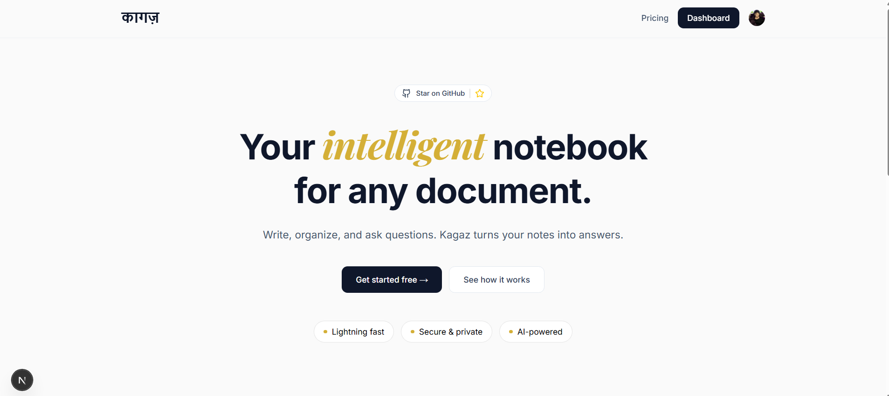
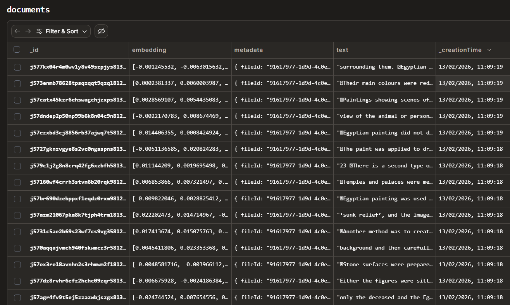

<div align="center">

# 📝 Kagaz (काग़ज़)

### The Intelligent Workspace for Document Analysis & Note-Taking
*Transform your generic PDFs into interactive, AI-powered knowledge bases.*

[](https://nextjs.org/)
[](https://convex.dev/)
[](https://deepmind.google/technologies/gemini/)
[](https://stripe.com/)

[Request Feature](https://github.com/Ankitmohanty2/kagaz/issues) • [Deployment Guide](.brain/bdf52fa7-376d-4c16-9482-5568c2f15e57/deployment_guide.md)

---



</div>

## ✨ Features

- **🚀 Smart PDF Analysis:** Harness the power of Gemini 2.5 to analyze complex documents instantly.
- **🎨 Premium Focus Editor:** A distraction-free workspace with rich-text capabilities and glassmorphism UI.
- **🌗 Seamless Dark Mode:** Custom-tuned "Premium Slate" theme for deep work and high focus.
- **💳 Multi-Tier Subscription:** Integrated Stripe payments with INR/Yearly Pro access.
- **🔍 Vector Search (RAG):** Context-aware AI responses using high-precision document chunking and indexing.
- **🔐 Enterprise Auth:** Secure, high-end authentication powered by Clerk.

---

### 🧠 Document Embedding Success

*Deep-level processing: Kagaz uses high-dimensional vector embeddings to understand your documents with clinical precision.*

---
## 🛠️ Tech Stack

- **Frontend:** Next.js 15+, Tailwind CSS, Tiptap (Wealth Management Grade Editor)
- **Backend:** Convex (Real-time DB + Serverless Functions)
- **AI Engine:** Google Gemini Pro + LangChain (RAG Architecture)
- **Authentication:** Clerk Global Identity
- **Payments:** Stripe (Automated Fulfillment)

---

## 🚀 Getting Started

### Prerequisites

- Node.js 18+ & npm
- Accounts for [Convex](https://convex.dev/), [Clerk](https://clerk.com/), [Stripe](https://stripe.com/), and [Google AI Studio](https://aistudio.google.com/).

### Installation

1. **Clone & Install**
   ```bash
   git clone https://github.com/Ankitmohanty2/kagaz.git
   cd kagaz
   npm install
   ```

2. **Environment Configuration**
   Create a `.env.local` file and populate it with your API keys (see `.env.example` for the full list).

3. **Backend Initialization**
   ```bash
   npx convex dev
   ```

4. **Launch Application**
   ```bash
   npm run dev
   ```

---

## 🌎 Deployment

Kagaz is designed to be deployed seamlessly on **Vercel**. For a complete production checklist, including Convex and Stripe configuration, please refer to our **[Deployment Guide](.brain/bdf52fa7-376d-4c16-9482-5568c2f15e57/deployment_guide.md)**.

---

## 📈 Roadmap

- [ ] Collaborative real-time editing
- [ ] Multi-document folder organization
- [ ] Export to Markdown/Docx/PDF
- [ ] Advanced Mobile-Responsive App

---

<div align="center">

Made with ❤️ by [Ankit](https://github.com/Ankitmohanty2)

**Star this project if you find it helpful! ⭐**

</div>
